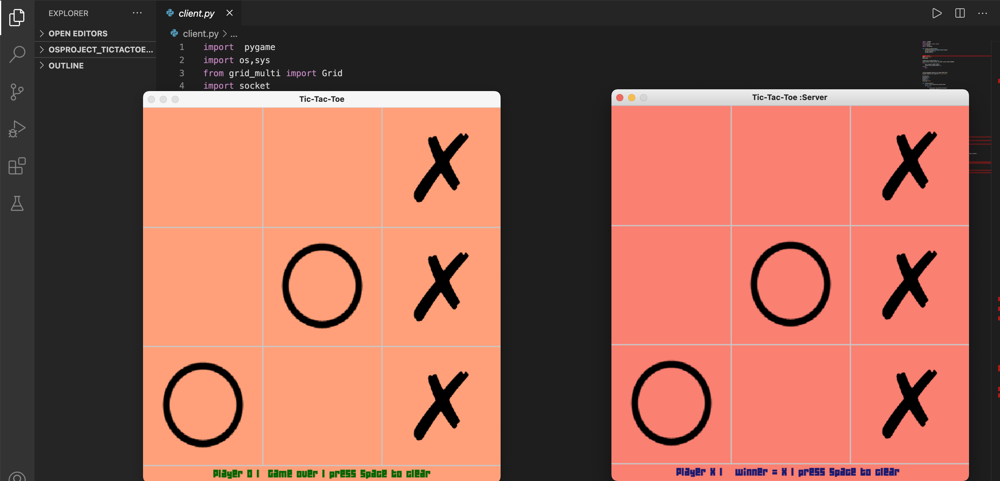

# TicTacToe
Developed a multiplayer multithreaded tic-tac-toe game in python3 using the pygame module along with the socket and threading library.This was done as the final project of Operating Systems course.

# Procedure 

Procedure to Run the game:

  ● Step 1:​ Open the terminal.
  
  ● Step 2:​ Run “​server.py​”.
  
  ● Step 3:​ Open another terminal and run “​client.py​”.
  
  ○ *Note* : In the footer of the game window, it shows whose turn it is. (​Note:​ Please make sure you are inside the project directory)

  ● After these steps, two separate windows open for each of the players. 

  ● Click on the box in which you want to place your symbol. 

  ● Follow the prompts in the status bar and enjoy!
  
# Output 
  
  

